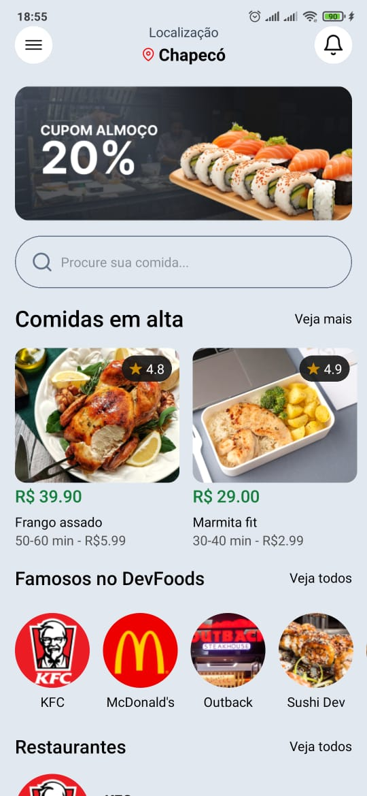

# Projeto de Aplicativo de Vendas de um Delivery

Este projeto é um aplicativo mobile desenvolvido em React Native para um serviço de delivery, onde os usuários podem explorar opções de pratos e fazer pedidos.

## Links

- Criado a partir das aulas do YouTube de [SujeitoProgramador](https://www.youtube.com/@Sujeitoprogramador)
